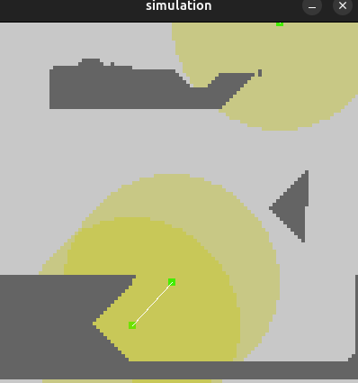

# RAPID
Robotics Agent Prototyping for Intelligence Development

This Software is designed for rapid prototyping of multi-robots behaviors. We can run multiagent simulations permitting to observe collective effects of our behaviors.

**Please, check the [Wiki](https://github.com/R1leMargoulin/RAPID/wiki) for a detailed documentation**

This project is made with python, using pygame library.

# Getting started
## Installation
To begin, it is recommanded to use a virtual environment.

With this project, I used python 3.12
#### Virtual Environment setup
**Conda**:
```bash
conda create -p PATH/ENVNAME python=3.12
conda activate PATH/ENVNAME
```
change above PATH to the pathe you want your environment to be and ENVNAME the name of the environment.

**virtualenv**:

```bash
pip install virtualenv
python3.12 -m venv ENVNAME
source env/bin/activate
```

### Package installation
Make sure to have git installed on your computer.


Go in the directory you want to place this repo and pull it :
```bash
git pull https://github.com/R1leMargoulin/RAPID.git
```

Then install the package with pip:
```bash
cd RAPID

#if you just want to install the package
pip install .

#if you wish to edit it
pip install -e .
```


## Quick run
In the **examples/program_examples** directory, you can find three programs:

- **simulation_example.py**: In this file, we simply run a simulation.
- **manual_experiment_example.py**: In this file, we run a serie of simulations, and write some evaluation metrics in a file.
- **data_usage.py**: This file draws figure from what's generated from the "manual_experiment_example.py" file
- **experiment_from_config_example.py** : in this file, we use a config file in the form of files in the **examples/config_examples** directory

Environment can be made with images, here are some examples:

Here is an example of exploration in a "labyrinth" environment using the action selection behavior.


**Please, check the [Wiki](https://github.com/R1leMargoulin/RAPID/wiki) for a detailed documentation**

On the below images, we can see on the left a forest simulated environment used in an exploration scenario.While on the middle, we can see a wall with an opening, environment, used in a target point scenario where an amount of agents needs to go near the target point (in red on the image). On the right,
we can see an exploration scenario with a limited range of communication




Those images can be found in the **examples/env_images_example** directory.
